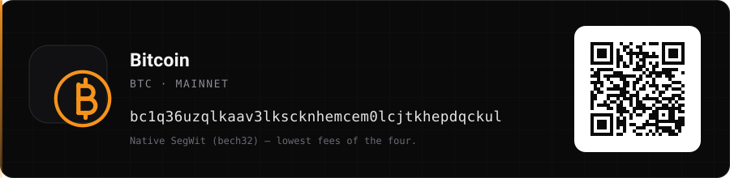

<div align="center">
  
  <br><br>

  **English** · [فارسی](README.fa.md) · [Русский](README.ru.md) · [العربية](README.ar.md) · [中文](README.zh.md)

  [](https://nextjs.org)
  [](tsconfig.json)
  [](tests)
  [](docs/i18n.md)
  [](docker-compose.yml)
  [](LICENSE)


  ⭐ **[Star it](https://github.com/mmdverse/m-ui/stargazers)** if it is useful · 💛 **[Support the project](#support-the-project)**

  *Self-hosted control plane for proxy servers — with a censorship model that is
  measured, versioned and tested like the rest of the code.*
</div>

---

## Overview

**M-UI** is a self-hosted panel for managing servers, proxy configurations and
tunnels. It provisions real access on real machines over SSH, keeps every share
link stable, and — the part most panels skip — **models the censorship system
between your client and your server**, so a configuration can be evaluated
before a single user is handed a link.

**Free and open: MIT licensed — personal use, commercial use and self-hosting, no restrictions.**

Three things live in this repository:

| | What | Where |
|---|---|---|
| **The panel** | Servers, monitoring, configurations, tunnels, users, roles, SOCKS5 deployment, WireGuard, five-language UI | `src/pages`, `src/lib` |
| **The censorship engine** | 11 countries × 18 filtering layers × 15 bypass plans, a scoring model, and per-country configuration generation | `src/lib/censorship` |
| **The laboratory** | A Python DPI simulator and a real-Xray end-to-end harness that the model is answerable to | `testenv/censor`, `testenv/world-matrix.py` |

The engine and the laboratory are not decoration: `npm test` fails when the
model and the simulator disagree, when a layer claims to be simulated without a
measurement behind it, or when a generated transit config is not accepted by
Xray itself.

---

## Feature set

<table>
<tr><th align="left">Area</th><th align="left">What it does</th></tr>
<tr><td><b>Servers</b></td><td>Add by password or SSH key. The connection is verified before the server is stored; secrets are encrypted at rest and never returned by the API.</td></tr>
<tr><td><b>Monitoring</b></td><td>CPU, RAM, load, uptime and per-interface traffic read from <code>/proc</code> and sampled on a schedule, charted over seven days. Servers that go away are marked stale instead of showing invented numbers.</td></tr>
<tr><td><b>Configurations</b></td><td>VMess, VLESS, Trojan and Shadowsocks share links with TLS, WebSocket, gRPC, HTTP, KCP, QUIC and CDN fronting; REALITY with <code>pbk</code> / <code>fp</code> / <code>sid</code>; XHTTP with <code>stream-up</code>.</td></tr>
<tr><td><b>Stable identity</b></td><td>UUIDs and passwords are generated once and persisted, so a link never changes under a user.</td></tr>
<tr><td><b>SOCKS5 deployment</b></td><td>Installs and runs microsocks on the target server with per-config credentials, across <code>apt</code>, <code>dnf</code>, <code>yum</code> and <code>apk</code>.</td></tr>
<tr><td><b>WireGuard</b></td><td>X25519 keypairs and a ready-to-import client <code>.conf</code>.</td></tr>
<tr><td><b>Tunnels</b></td><td>SSH reverse tunnels are started and stopped for real through the OpenSSH client. Direct, FRP and WireGuard tunnels are recorded and planned, not executed.</td></tr>
<tr><td><b>Connection advisor</b></td><td>Scores a configuration against the profile of the network it will run on: burned SNIs, blocked ports, unsafe uTLS fingerprints, UDP handling, protocol whitelists.</td></tr>
<tr><td><b>Censorship atlas</b></td><td>A dedicated page per country: the filtering layers with severity and confidence, the ranked bypass plans with reasons, a generated configuration for the winner, the transit pipeline, and the sources behind every claim.</td></tr>
<tr><td><b>Transit pipeline</b></td><td>Entry → relay → exit chains, with a real Xray config per hop, validated by running <code>xray run -test</code> in the test suite.</td></tr>
<tr><td><b>Access control</b></td><td>JWT sessions, bcrypt hashes, login rate limiting with equal response timing for unknown users, roles enforced on every write route.</td></tr>
<tr><td><b>Deployment</b></td><td><code>docker compose</code> from source, or <code>npm ci &amp;&amp; npm run build</code>. Production refuses to boot without a <code>JWT_SECRET</code>.</td></tr>
</table>

---

## The censorship engine

The engine answers one question per (country, plan) pair: *if this client
connected this way from inside that network, which filtering layers would take
it down, and what compensates?*

### The three data sets

| Set | Size | Meaning |
|---|---|---|
| **Layers** | 18 mechanisms | A concrete inspection or block: DNS poisoning, SNI reset, ECH drop, TCP reassembly, QUIC v1 fingerprinting, fully-encrypted-traffic heuristics, JA4 allowlists, protocol whitelists, IP/ASN blocks, active probing, flow classification, TLS-in-TLS heuristics. |
| **Plans** | 15 combinations of protocol, transport, security and obfuscation | From `VLESS + REALITY + Vision + finalmask` down to `plain WireGuard`. Each plan declares which layers it covers, which partially, and which it leaves exposed. |
| **Countries** | 11 profiles | The layers actually present, their severity, and a confidence label — `measured`, `reported`, or `heuristic`. |

### Scoring

```text
score = 100 − Σ penalty        (clamped at 0)
penalty = 5 × severity   for an exposed layer        (severity 1–5)
        + 3 × severity   for a partially covered layer
        + 40             when the plan's port is blocked in that country

85+  resilient        65–84  usable        45–64  fragile        <65  avoid
```

Severity is per country, so an SNI block that is a nuisance in Turkey can be a
hard reset in Russia. Confidence and severity are both shown in the panel, so a
`reported` layer never reads like a measurement.

### Coverage matrix

Every cell is the model's score for that plan in that country. Full table, all
15 plans × 11 countries.

| Plan | 🇮🇷 ir | 🇷🇺 ru | 🇨🇳 cn | 🇹🇲 tm | 🇧🇾 by | 🇦🇪 ae | 🇰🇿 kz | 🇹🇷 tr | 🇵🇰 pk | 🇸🇦 sa |
|---|:--:|:--:|:--:|:--:|:--:|:--:|:--:|:--:|:--:|:--:|
| **reality-vision-frag** | 91 ✅ | **67** 🟢 | 76 🟢 | 76 🟢 | 91 ✅ | 94 ✅ | 91 ✅ | 100 ✅ | 91 ✅ | 100 ✅ |
| reality-vision | 91 ✅ | 32 🔴 | 76 🟢 | 76 🟢 | 91 ✅ | 94 ✅ | 76 🟢 | 100 ✅ | 91 ✅ | 100 ✅ |
| reality-xhttp | 91 ✅ | 41 🔴 | **88 ✅** | 76 🟢 | 91 ✅ | 94 ✅ | 76 🟢 | 100 ✅ | 91 ✅ | 100 ✅ |
| ws-tls-cdn | 80 🟢 | 11 🔴 | 51 🟠 | **80** 🟢 | 80 🟢 | 80 🟢 | 85 ✅ | 85 ✅ | 75 🟢 | 85 ✅ |
| ss2022-tls-plugin | 79 🟢 | 9 🔴 | 49 🟠 | 68 🟢 | 79 🟢 | 85 ✅ | 64 🟠 | 91 ✅ | 79 🟢 | 91 ✅ |
| trojan-tls | 64 🟠 | 9 🔴 | 24 🔴 | 48 🟠 | 79 🟢 | 85 ✅ | 64 🟠 | 91 ✅ | 79 🟢 | 91 ✅ |
| hy2-obfs-unknownver | 33 🔴 | 0 🔴 | 17 🔴 | 31 🔴 | 73 🟢 | 64 🟠 | 58 🟠 | 85 ✅ | 70 🟢 | 82 🟢 |
| amneziawg | 25 🔴 | 0 🔴 | 0 🔴 | 31 🔴 | 65 🟢 | 58 🟠 | 50 🟠 | 79 🟢 | 62 🟠 | 76 🟢 |
| vmess-ws-tls | 45 🟠 | 0 🔴 | 1 🔴 | 60 🟠 | 60 🟠 | 65 🟢 | 65 🟢 | 70 🟢 | 55 🟠 | 70 🟢 |
| wireguard (plain) | 0 🔴 | 0 🔴 | 0 🔴 | 0 🔴 | 35 🔴 | 28 🔴 | 40 🔴 | 60 🟠 | 25 🔴 | 55 🟠 |
| openvpn-tcp | 11 🔴 | 0 🔴 | 0 🔴 | 0 🔴 | 51 🟠 | 47 🟠 | 56 🟠 | 70 🟢 | 46 🟠 | 70 🟢 |
| ssh-tunnel | 11 🔴 | 0 🔴 | 0 🔴 | 23 🔴 | 51 🟠 | 47 🟠 | 56 🟠 | 70 🟢 | 46 🟠 | 70 🟢 |
| hy2-obfs (quic v1) | 25 🔴 | 0 🔴 | 0 🔴 | 31 🔴 | 69 🟢 | 58 🟠 | 54 🟠 | 81 🟢 | 64 🟠 | 76 🟢 |
| ss2022-plain | 5 🔴 | 0 🔴 | 0 🔴 | 0 🔴 | 45 🟠 | 43 🔴 | 50 🟠 | 70 🟢 | 40 🔴 | 70 🟢 |
| vmess-tcp-plain | 5 🔴 | 0 🔴 | 0 🔴 | 0 🔴 | 45 🟠 | 43 🔴 | 50 🟠 | 70 🟢 | 40 🔴 | 70 🟢 |

Read it as a map of the world in 2026, not as a leaderboard:

- **Where wholesale blocking rules**: Turkmenistan (protocol whitelist), Iran
  (protocol whitelist + UDP filtering), Russia (reassembly + QUIC v1 + an SNI
  whitelist in some regions). Here the top plan is not a preference, it is the
  difference between working and not working.
- **Where traffic classification rules**: China and the UAE. China punishes
  entropy with probabilistic fully-encrypted-traffic detection; the UAE
  maintains a browser-fingerprint allowlist. Both are defeated by looking like
  a browser, not by being faster.
- **Where only some hosts are burned**: Turkey, Saudi Arabia, Pakistan, Belarus.
  A majority of plans stay usable; the job is avoiding the specific SNIs and
  ASNs on the list, not fighting a classifier.
- **Reality + Vision is the floor, not the ceiling.** With fragmentation it is
  the only design that clears the bar in all four hard countries — and it still
  only reaches `67` in Russia, where the fix is fragmentation, not a different
  protocol.

---

## Country dossiers

Each dossier lists the layers the model attributes to that country, the
confidence behind each one, the engineering that actually gets through, and the
model's verdict. Layer tables are generated from
[`src/lib/censorship/countries.ts`](src/lib/censorship/countries.ts) — the same
file the Python simulator consumes.

### 🇮🇷 Iran — NGFW family, national filtering

> **Blocking model:** DNS poisoning on the ISP resolvers, SNI resets on a burned
> domain list, and — the part that decides everything — a **protocol whitelist**
> in which only DNS and HTTP(S) leave the country. A tunnel that is not shaped
> like TLS on a permitted port is dropped regardless of which port it uses.

| Layer | Sev | Confidence | Simulated | What it inspects |
|---|:--:|:--:|:--:|---|
| `proto_whitelist` | 5 | measured | — | Whether the flow is DNS/HTTP(S) at all. Kills SSH, plain WireGuard, bare Shadowsocks, OpenVPN. |
| `sni_block` | 4 | measured | ✔ | The SNI field against a burned list (`x.com`, `twitter.com`, `instagram.com`, `facebook.com`, `youtube.com`, `telegram.org` in the profile). |
| `proto_fingerprint` | 4 | measured | ✔ | Protocol handshakes and first-packet shape of known proxy protocols. |
| `udp_filter` | 4 | measured | — | UDP beyond DNS; QUIC and WireGuard payloads are policy-filtered, not just rate-limited. |
| `dns_poison` | 4 | measured | — | A resolver pool answering with the interception block page. |
| `http_host_inject` | 3 | measured | — | Plain HTTP Host headers, rewritten to a block page. |
| `active_probe` | 3 | measured | — | Replayed and synthetic probes against discovered endpoints. |
| `ip_block` | 3 | measured | — | Datacentre ASNs (DigitalOcean, Linode, Vultr in the profile) that are bulk-blocked. |

**Field engineering**

1. **Become TLS on 443.** REALITY is the shortest path: the handshake is a real
   TLS handshake against a real site, with a certificate borrowed from a
   destination that is not blocked. Nothing about the exchange looks like a
   tunnel, because the censor is looking at a genuine site's certificate.
2. **Never send a nested length pattern.** `flow: xtls-rprx-vision` removes the
   inner-TLS record-size signature that makes a tunnel visible to a size
   heuristic, which is why plain Trojan/VMess-over-TLS degrade here.
3. **Split at the record level as well as the segment level.** finalmask
   fragmentation breaks the ClientHello into several TLS records with a delay
   between them, so the SNI never appears whole in one segment:

   ```json
   "streamSettings": {
     "security": "reality",
     "realitySettings": { "serverName": "www.microsoft.com", "fingerprint": "chrome" },
     "finalmask": {
       "tcp": [{ "type": "fragment",
                 "settings": { "packets": "tlshello", "length": "100-200",
                               "delay": "10-20", "maxSplit": "4-8" } }]
     }
   }
   ```

   Note: `streamSettings.fragment` is the older key and Xray 25+ ignores it
   silently. Use `finalmask`.
4. **Hold a burnable address.** The ASN filter is real, so keep a second entry
   address in a different ASN and rotate it, instead of rebuilding accounts.
5. **Do not rely on UDP.** Any plan whose transport is QUIC or WireGuard scores
   at or below 33 here; use TCP/443 plans and let the exit handle UDP traffic.

**Verdict:** `reality-vision-frag`, `reality-vision` and `reality-xhttp` all
reach **91/100 (resilient)**; no top plan has an uncovered layer of severity 4+.
Everything without a TLS shape lands between 0 and 45.

**Sources:** [Iran's stealth blackout (arXiv 2507.14183)](https://arxiv.org/pdf/2507.14183) · [Allowlist persistence & UDP filtering (arXiv 2603.28753)](https://arxiv.org/html/2603.28753v1) · [Miaan blackout report](https://miaan.org/)

---

### 🇷🇺 Russia — TSPU / RKN

> **Blocking model:** the hardest profile in the model, and the most
> interesting one technically. TSPU sits in-path and stateful, reassembles
> **both** the TCP stream and the TLS records, drops QUIC v1 Initials above
> 1000 bytes wholesale, drops ECH handshakes, blocks foreign datacentre ASNs at
> the SYN level, and — reported since mid-2025 — runs an SNI **allowlist** in
> some regions.

| Layer | Sev | Confidence | Simulated | What it inspects |
|---|:--:|:--:|:--:|---|
| `sni_block` | 5 | measured | ✔ | SNI against a block list, plus SNI-based throttling of the rest. |
| `proto_fingerprint` | 5 | measured | ✔ | Fixed handshakes: the 148-byte WireGuard initiation, OpenVPN opcodes, first-packet shape. |
| `reassembly` | 4 | measured | ✔ | TCP segments **and** TLS records are reassembled before inspection, which is what defeats single-layer splits. |
| `quic_v1_fingerprint` | 4 | measured | ✔ | QUIC v1 Initial packets, dropped once they carry more than ~1000 bytes. |
| `ip_block` | 4 | measured | — | Foreign cloud ASNs (Hetzner, OVH, DigitalOcean) blocked at the SYN level by several ISPs. |
| `sni_whitelist` | 4 | reported | ✔ | Allowlist mode: only a fixed set of SNIs is permitted; everything else is dropped. |
| `ech_drop` | 3 | measured | ✔ | ClientHello carrying ECH. Present since Nov 2024. |
| `udp_filter` | 3 | measured | — | Non-DNS UDP, with QUIC handled as a special case. |
| `ml_flow` | 3 | reported | — | Statistical flow classification — size, timing, direction ratio. |

**Field engineering**

1. **Split twice, or it is not a split.** This is the single most valuable
   finding in the model: TCP segmentation alone is insufficient, and TLS record
   fragmentation alone is insufficient; the pair defeats reassembly because
   neither side can be reconstructed independently. `reality-vision-frag`
   covers it, and it is worth **35 points** over the same plan without
   fragmentation (67 vs 32).
2. **Use finalmask, not `streamSettings.fragment`.** Measured on Xray 26.3.27:
   the legacy key produces a single 1818-byte record; finalmask produces five
   records — `[118, 155, 192, 183, 1106]` — deterministically.
3. **Treat QUIC v1 as blocked.** With the profile's rule (version 1 to port 443
   with a payload larger than 1001 bytes) the whole flow is dropped, not one
   packet. Hysteria2 only survives here in the unknown-version variant, and even
   that is a partial.
4. **Keep ECH off.** An ECH-bearing ClientHello to a Cloudflare SNI is dropped,
   so enabling ECH "for privacy" removes the connection.
5. **Assume the SNI list is now an allowlist.** Where that mode is active the
   only working REALITY destinations are whitelisted domains — in practice a
   national domain or a major local service. The atlas marks this layer
   `reported` because region coverage varies.
6. **Never pick a burned cloud ASN.** If your entry IP is in a blocked ASN,
   nothing above this line matters.

**Verdict:** `reality-vision-frag` at **67/100 (usable)** — the only plan in the
top zone. Without fragmentation, the same protocol collapses to 32. XHTTP and
CDN fronting score 41 and 11 here, because neither touches the reassembly
problem.

**Sources:** [TSPU, IMC'22](https://ensa.fi/papers/tspu-imc22.pdf) · [ECH in censorship circumvention, FOCI 2025](https://www.petsymposium.org/foci/2025/foci-2025-0016.pdf) · [net4people #490 (SNI allowlist + checkers)](https://github.com/net4people/bbs/issues/490) · [FBK/ACF *Access Denied*](https://fbk.info/files/acf-internet-report-EN.pdf)

---

### 🇨🇳 China — GFW

> **Blocking model:** a classifier, not a list. DNS poisoning and SNI blocking
> are the reliable part; the interesting part is **fully-encrypted-traffic
> detection** with five exemption heuristics and probabilistic enforcement, and
> QUIC Initial decryption at scale.

| Layer | Sev | Confidence | Simulated | What it inspects |
|---|:--:|:--:|:--:|---|
| `sni_block` | 5 | measured | ✔ | SNI against a large list. |
| `proto_fingerprint` | 5 | measured | ✔ | Protocol handshakes and known first-packet shapes. |
| `fep_detect` | 5 | measured | ✔ | Entropy and printable-character structure of the first payload, then **probabilistic blocking** rather than a hard block. |
| `active_probe` | 5 | measured | — | Seven probe types against endpoints found to look like Shadowsocks: replay, random payloads, HTTP 404, TLS, QUIC, ackless. |
| `tls_in_tls` | 4 | heuristic | — | Statistical/temporal nested-TLS detection. Deliberately **not simulated** — see below. |
| `quic_sni` | 4 | measured | ✔ | QUIC Initial decryption, but only when the first packet is a decryptable Initial. |
| `ip_block` | 4 | measured | — | Datacentre ASN and bulk IP-level blocking. |
| `ml_flow` | 4 | reported | — | Machine-learning flow classification on top of the hand-written rules. |
| `dns_poison` | 4 | measured | — | Poisoned answers, including regional variants. |
| `dns_doh_block` | 3 | reported | — | Encrypted DNS endpoints. |
| `udp_filter` | 3 | measured | — | UDP beyond DNS, with QUIC treated as a first-class case. |

**Field engineering**

1. **Pass the exemption list, do not beat it.** The FEP classifier exempts
   traffic that looks like a protocol it knows, and its heuristics are
   structural: printable fraction, longest printable run, the first several
   printable bytes, popcount-entropy band, and a recognisable protocol
   fingerprint. Plain Shadowsocks-2022 fails all five by construction — every
   byte is random from byte zero. Wrapping it in TLS + WebSocket moves it from
   `0` to `49–88` depending on the rest of the plan.
2. **A five-byte preamble is not a fix.** A short alphanumeric prefix is enough
   to slip past the printed-text heuristics, but it leaves the protocol
   fingerprint heuristic intact — the model scores the effect, it does not
   pretend to be a bypass.
3. **Blocking here is probabilistic, and the lab proves it.** In a real run
   against the simulator, Shadowsocks-2022 was reset on **4–5 of 8** connections
   and VMess-over-TCP on **3–5 of 8**, both depending on the random salt in the
   first packet. That is why the case is asserted as `mixed`, not `block`.
4. **Split the flows.** Single-connection nested-TLS heuristics are the reason
   XHTTP exists: with `mode: stream-up` the upload and download live in
   different flows, so a heuristic that needs both directions of one connection
   loses its grip. `reality-xhttp` is the best plan in this country at
   **88/100**.
5. **QUIC is only safe unversioned.** If the first packet is a decryptable
   Initial, it gets decrypted and filtered; an unknown-version Initial is not
   decryptable at all. This is the only QUIC variant that scores above 60
   anywhere in the table.
6. **TLS-in-TLS is reported, never simulated.** Measurement showed that XTLS
   Vision's own padding produces application records in the same size range as
   a nested ClientHello (69/1203/669/1311 bytes on one run), so a size-window
   rule both blocks legitimate traffic and cannot be validated on a loopback
   harness. The layer stays in the model with `simulated: false`, and a test
   asserts it is never marked simulated.

**Verdict:** `reality-xhttp` **88/100 (resilient)**; `reality-vision-frag` and
`reality-vision` follow at 76. Everything without a TLS shape sits between 0
and 51.

**Sources:** [How the GFW detects and blocks fully encrypted traffic, USENIX Sec'23](https://www.usenix.org/system/files/usenixsecurity23-wu-mingshi.pdf) · [How China detects and blocks Shadowsocks, IMC'20](https://gfw.report/publications/imc20/en/) · [SNI-based QUIC censorship, USENIX Sec'25](https://gfw.report/publications/usenixsecurity25/en/) · [Regional censorship in China, S&P'25](https://gfw.report/publications/sp25/en/) · [XHTTP: beyond REALITY (Xray-core #4113)](https://github.com/XTLS/Xray-core/discussions/4113)

---

### 🇹🇲 Turkmenistan — full whitelist

> **Blocking model:** not a filter, a door list. Traffic is permitted only if it
> belongs to a small set of national domains and approved services — the
> default answer is "no". Domain fronting is the standard local workaround.

| Layer | Sev | Confidence | Simulated | What it inspects |
|---|:--:|:--:|:--:|---|
| `proto_whitelist` | 5 | measured | — | Anything that is not HTTP(S)/DNS is dropped. |
| `fep_detect` | 5 | reported | ✔ | Fully-encrypted payloads are refused even when they are TLS-shaped. |
| `sni_whitelist` | 4 | reported | ✔ | Only a fixed set of domains is allowed (`.tm`, `yandex.ru`, `mail.ru`, `vk.com`, `ok.ru` in the profile). |
| `ip_block` | 4 | measured | — | Foreign hosting ASNs. |
| `active_probe` | 4 | reported | — | Probing of endpoints that look like a tunnel. |

**Field engineering**

1. **Ride a permitted name.** A CDN in front of a whitelisted-looking hostname
   is the only design that scores well: `ws-tls-cdn` reaches **80/100**, the
   best result in the country, even though it loses a point for the SNI
   allowlist.
2. **Choose the SNI deliberately.** REALITY's `serverNames` must be a domain
   from the allowed set; the profile marks the whitelist layer as exposed for
   everything else, and gives `sni_whitelist` its own remediation hint in the
   panel.
3. **Prefer a CDN's ASN over a VPS ASN.** The IP layer is severity 4 here and it
   is an ASN list, not a reputation score — a fresh IP in the wrong ASN is worse
   than an old IP in the right one.
4. **Assume QUIC is gone.** There is no UDP path worth designing around; a plan
   whose transport is UDP cannot be rescued by obfuscation.

**Verdict:** `ws-tls-cdn` **80/100**, then the REALITY family at 76. Every UDP
or cleartext plan scores at or below 31.

**Sources:** [Anti-DPI tables, 2026](https://www.vpnsmith.com/en/blog/anti-dpi-vpn-bypass-2026) · [Tor Project — connecting from censored regions](https://support.torproject.org/tor-browser/circumvention/connecting-from-censored-regions/)

---

### 🇦🇪 United Arab Emirates — JA4 fingerprint allowlist

> **Blocking model:** the only country in the model where the decisive layer is
> a TLS **fingerprint allowlist**. The DPI expects the ClientHello of a real
> browser; a fingerprint that no browser produces is refused even if the
> protocol is perfectly legal.

| Layer | Sev | Confidence | Simulated | What it inspects |
|---|:--:|:--:|:--:|---|
| `ja4_fingerprint` | 4 | measured | ✔ | The JA4 fingerprint of the ClientHello against a browser allowlist. |
| `proto_fingerprint` | 4 | reported | ✔ | Known proxy handshakes. |
| `sni_block` | 3 | reported | ✔ | A short block list (`signal.org`, `discord.com` in the profile). |
| `udp_filter` | 3 | reported | — | VoIP-adjacent UDP patterns. |
| `ip_block` | 2 | reported | — | A small number of hosting ranges. |

**Field engineering**

1. **Send a browser's ClientHello, byte for byte.** `tlsSettings.fingerprint`
   in Xray maps to the measured profiles below; the model allows exactly the
   fingerprints a browser actually emits.
2. **JA4, not JA3.** This came out of our own measurement: with the uTLS
   `chrome` profile, 15 consecutive connections produced **15 different JA3
   hashes** — Chrome permutes its extension order — but **one stable JA4**.
   Any allowlist keyed on JA3 would be unusable; the engine keys on JA4.

   | Profile | JA4 (measured on Xray 26.3.27) | Stable? |
   |---|---|---|
   | `chrome` / `default` | `t13d1516h2_8daaf6152771_8ee26baaef31` | ✔ 1 variant in 15 connections |
   | `firefox` | `t13d1715h2_5b57614c22b0_a06ecb99ca30` | ✔ |
   | `safari` | `t13d2013h2_a09f3c656075_2ee3dc641d29` | ✔ |
   | `ios` | `t13d2613h2_2802a3db6c62_a7cb7461f8a0` | ✔ |
   | `android` | `t12d120700_d34a8e72043a_ba336a2cc70c` | ✔ |
   | `edge` | `t13d1515h2_8daaf6152771_d2a542b11920` | ✔ |
   | `random` / `randomized` | changes per connection (3 variants observed) | ✘ never allowlisted |

3. **Never ship a randomised fingerprint** to a country that filters on
   fingerprints. A profile that mutates per connection can never sit in an
   allowlist, so it fails on the first connection — the lab asserts exactly this
   case (`ae-tls-randomized` → blocked, `ja4_fingerprint`).
4. **The fingerprint must be consistent across the whole session**, including
   any CDN or relay in front — a browser-like ClientHello followed by a
   non-browser ALPN, or vice versa, is a mismatch.

**Verdict:** the REALITY family and the browser-fingerprint plans reach
**94/100**; the plain Shadowsocks/VMess plans collapse to 43 and the plain
WireGuard plan to 28.

**Sources:** [Anti-DPI tables, 2026](https://www.vpnsmith.com/en/blog/anti-dpi-vpn-bypass-2026) · **own measurement:** [`testenv/censor/fpmeasure.py`](testenv/censor/fpmeasure.py) → [`src/lib/censorship/fingerprints.ts`](src/lib/censorship/fingerprints.ts)

---

### 🇧🇾 Belarus — Belpak, a Russian-model deployment

> **Blocking model:** the same architecture as Russia, deployed with fewer
> resources and less consistency: SNI blocking, protocol fingerprinting, IP
> blocking from an older list, and light UDP handling.

| Layer | Sev | Confidence | Simulated | What it inspects |
|---|:--:|:--:|:--:|---|
| `sni_block` | 4 | reported | ✔ | A block list. |
| `proto_fingerprint` | 4 | reported | ✔ | Fixed handshakes. |
| `ip_block` | 3 | reported | — | Hosting ranges (OVH, Hetzner in the profile). |
| `udp_filter` | 2 | reported | — | Opportunistic UDP filtering. |

**Field engineering:** REALITY on 443 with a browser fingerprint is sufficient;
there is no reassembly layer, so fragmentation is optional here. Nine of the
fifteen plans are usable — the most permissive of the four hard countries — and
only here do obfuscated UDP designs survive: AmneziaWG at 65 and Hysteria2 in
both variants (69 and 73), because the fixed 148-byte WireGuard initiation is
broken up by junk packets and randomised message types.

**Verdict:** **91/100** for the REALITY family; 35 for plain WireGuard.

**Sources:** [Anti-DPI tables, 2026](https://www.vpnsmith.com/en/blog/anti-dpi-vpn-bypass-2026) · [Tor Project — censored regions](https://support.torproject.org/tor-browser/circumvention/connecting-from-censored-regions/)

---

### 🇰🇿 Kazakhstan — exported GFW/TSPU stack

> **Blocking model:** a licensed DPI stack of the same lineage as the GFW and
> TSPU deployments, exported under Belt-and-Road programmes: SNI blocking, ECH
> drops, IP-level blocks.

| Layer | Sev | Confidence | Simulated | What it inspects |
|---|:--:|:--:|:--:|---|
| `sni_block` | 4 | reported | ✔ | A block list, applied consistently. |
| `ech_drop` | 3 | reported | ✔ | ClientHello carrying ECH. |
| `ip_block` | 3 | reported | — | Hosting ranges. |
| `udp_filter` | 2 | reported | — | Opportunistic UDP filtering. |

**Field engineering:** the exported stack behaves like an early TSPU — SNI
blocking and ECH drops, no reassembly. REALITY with a browser fingerprint is
the answer — **91** with fragmentation, 76 without — and `ws-tls-cdn` clears the
bar at 85 as the CDN-backed fallback. Keep ECH disabled: same rule as Russia,
same reason.

**Verdict:** **91/100** (REALITY + fragmentation), **85** for CDN fronting, 76
for REALITY without fragmentation.

**Sources:** [GFW-derived DPI exported under Belt & Road](https://corpus.lantern.io/techniques/fully-encrypted-detect/) · [ECH in censorship circumvention, FOCI 2025](https://www.petsymposium.org/foci/2025/foci-2025-0016.pdf)

---

### 🇹🇷 Turkey — BTK, incident-driven filtering

> **Blocking model:** a smaller, reactive deployment. Blocks arrive as incidents
> around specific domains and services rather than as a standing classification
> engine.

| Layer | Sev | Confidence | Simulated | What it inspects |
|---|:--:|:--:|:--:|---|
| `sni_block` | 3 | reported | ✔ | A block list (`instagram.com`, `wikipedia.org` in the profile). |
| `proto_fingerprint` | 3 | reported | ✔ | Known proxy handshakes. |
| `udp_filter` | 2 | reported | — | Opportunistic UDP filtering. |

**Field engineering:** almost everything works. Fourteen of fifteen plans score
above 65; the only real requirement is not to reuse a burned SNI and to keep the
handshake browser-like. This is the profile used for the **entry leg** of the
transit pipeline in the atlas, because an uncomplicated but real filtering
regime is exactly what an entry node needs.

**Verdict:** **100/100** for the REALITY family and CDN fronting.

**Sources:** [VLESS/REALITY protocol matrix](https://fexyn.com/blog/vless-reality-protocol-guide)

---

### 🇵🇰 Pakistan — PTA, exported stack

> **Blocking model:** a DPI deployment from the same exported lineage, weighted
> towards SNI blocking and protocol fingerprinting, with IP blocks on foreign
> hosting.

| Layer | Sev | Confidence | Simulated | What it inspects |
|---|:--:|:--:|:--:|---|
| `proto_fingerprint` | 5 | reported | ✔ | Protocol handshakes — the highest severity here. |
| `sni_block` | 4 | reported | ✔ | A block list (`x.com`, `tiktok.com`, `wikipedia.org`). |
| `ip_block` | 3 | reported | — | Hosting ranges (DigitalOcean, Vultr). |
| `udp_filter` | 3 | reported | — | Non-DNS UDP. |

**Field engineering:** the fingerprint layer is severity 5, so shape matters
more than novelty: REALITY (**91**) or Shadowsocks-2022 behind WebSocket+TLS
(**79**). Plain UDP designs stay at 64 or below unless the first QUIC Initial
carries an unassigned version (70).

**Verdict:** **91/100** for REALITY, 79 for the TLS-wrapped Shadowsocks plugin.

**Sources:** [VLESS/REALITY protocol matrix](https://fexyn.com/blog/vless-reality-protocol-guide) · [GFW-derived DPI exports](https://corpus.lantern.io/techniques/fully-encrypted-detect/)

---

### 🇸🇦 Saudi Arabia — CITC

> **Blocking model:** protocol fingerprinting and a short block list, with
> policy-driven UDP handling around VoIP.

| Layer | Sev | Confidence | Simulated | What it inspects |
|---|:--:|:--:|:--:|---|
| `proto_fingerprint` | 3 | reported | ✔ | Known proxy handshakes. |
| `sni_block` | 3 | reported | ✔ | A short list. |
| `udp_filter` | 3 | reported | — | VoIP-adjacent UDP patterns. |

**Field engineering:** like Turkey, this is a case of avoiding the named
targets rather than fighting a classifier. Fourteen of fifteen plans clear 65;
the REALITY family and the TLS-wrapped Shadowsocks plan sit in the nineties,
CDN fronting at 85.

**Verdict:** **100/100** for the REALITY family and CDN fronting.

**Sources:** [VLESS/REALITY protocol matrix](https://fexyn.com/blog/vless-reality-protocol-guide)

---

### 🌐 Open network — the reference profile

No layers. Every plan scores 100, which is the point: the open profile is the
control. When a plan fails somewhere, the difference between that score and 100
is the cost the censorship system is imposing — and the reason the model can
say *"this is not a preference, it is 67 points of filtering."*

---

## What we measured ourselves

The model's inputs are public research; its edge cases are ours. Six
measurements, all reproducible from this repository:

| # | Measurement | Result | Reproduce with |
|:--:|---|---|---|
| 1 | **JA3 vs JA4 stability** for uTLS Chrome on Xray 26.3.27 | 15 connections → **15 distinct JA3**, **1 JA4**. JA3 allowlists are unusable; the decision key is JA4. | `testenv/censor/fpmeasure.py --cert <cert> --write-ts` |
| 2 | **Legacy `fragment` vs `finalmask`** | The old `streamSettings.fragment` key is inert — one 1818-byte record. `finalmask` splits the ClientHello into **5 records**: `[118, 155, 192, 183, 1106]`. | `testenv/frag-probe.py` |
| 3 | **Segment split vs record split** on a loopback harness | Record splitting is deterministic and claimable; TCP segment separation is not, because the kernel coalesces consecutive writes. Tests assert `record_split` and only report `tcp_split`. | `testenv/frag-probe.py`, `testenv/world-matrix.py` |
| 4 | **Chain overhead per hop** | 1 hop 91.463 ms, 3 hops 91.906 ms → **0.222 ms per hop** of processing. | `testenv/transit-lab.py` |
| 5 | **Placeholder REALITY keys are refused** | Xray exits with **rc=23** on a placeholder private key, so a half-configured generated config cannot be started by accident. The transit tests depend on this. | `tests/transit.test.ts` |
| 6 | **Fully-encrypted-traffic detection is probabilistic** | In the harness, Shadowsocks-2022 was reset on **4–5 of 8** connections and VMess-over-TCP on **3–5 of 8**, varying with the random first-packet salt. | `testenv/world-matrix.py --only cn` |

Every number above is also a test fixture. Change the model without changing the
measurement and the suite fails, in both runtimes: TypeScript
(`src/lib/censorship`) and Python (`testenv/censor`) share `rules.json`, which
is generated from the TypeScript source and byte-compared in CI.

---

## The DPI laboratory

```text
                   ┌──────────────┐   ┌───────────────────┐   ┌──────────────┐   ┌────────┐
  xray client ───► │ censor proxy │──►│ xray server side  │──►│  harness     │──►│ origin │
  (real config)    │  (per-case)  │   │ (reality/tls/ss/  │   │  dest:9447   │   │ http / │
                   │  DPI rules   │   │  vmess, :94xx)    │   │              │   │ https  │
                   └──────┬───────┘   └───────────────────┘   └──────────────┘   └────────┘
                          │
                          ▼  per-flow decisions + evidence
                   allow · sni_block · ja4_fingerprint · fep_detect · proto_whitelist · quic_v1 …
```

Each case is a real client, a real server, a real filtered path, and an expected
outcome with the layer that must produce it. Fifteen cases, run with
`python3 testenv/world-matrix.py`:

| Case | Country | Client profile | Expected | Layer / evidence |
|---|:--:|---|---|---|
| `ru-reality-frag` | ru | REALITY + Vision + finalmask | **allow** | `record_split: true` |
| `ru-reality-plain` | ru | REALITY + Vision | **allow** | `record_split: false` (control for the above) |
| `ru-reality-blocked-sni` | ru | REALITY, burned SNI | **block** | `sni_block` |
| `tm-whitelisted-sni` | tm | REALITY, permitted SNI | **allow** | — |
| `tm-other-sni` | tm | REALITY, other SNI | **block** | `sni_whitelist` |
| `ir-reality` | ir | REALITY + Vision + finalmask | **allow** | — |
| `ir-ss2022` | ir | naked Shadowsocks-2022 | **block** | `proto_whitelist` |
| `ae-tls-chrome` | ae | VLESS+TLS, `chrome` fingerprint | **allow** | `client: chrome` |
| `ae-tls-randomized` | ae | VLESS+TLS, randomised fingerprint | **block** | `ja4_fingerprint` |
| `cn-tls-not-simulated` | cn | VLESS+TLS, default profile | **allow** | proves TLS-in-TLS is not faked |
| `cn-reality-vision` | cn | REALITY + Vision | **allow** | — |
| `cn-reality-frag` | cn | REALITY + Vision + finalmask | **allow** | — |
| `cn-ss2022` | cn | naked Shadowsocks-2022 | **mixed** | `fep_detect`, 4–5 of 8 |
| `cn-vmess-tcp` | cn | VMess over TCP | **mixed** | `fep_detect`, 3–5 of 8 |
| `open-ss2022-control` | open | naked Shadowsocks-2022 | **allow** | control: the same client on an unfiltered path |

Two harness details worth knowing if you extend it: the proxy closes allowed
flows with a graceful FIN (an RST truncates nested-TLS flights and produces
false "blocked" verdicts), and the evidence is read from the **final** flow
state, because decisions are taken mid-flight.

Same harness, same rules as the panel:
`python3 testenv/censor/selftest.py` runs **66** simulator-level checks,
including the guard that TLS-in-TLS is never marked as simulated.

---

## Multi-hop transit

A single entry node is a single point of failure. The transit builder in
[`src/lib/censorship/transit.ts`](src/lib/censorship/transit.ts) composes a
chain in which **only the entry leg is observed by the target country**:

| Hop | Role | Plan | Why |
|---|---|---|---|
| `tr:443` | entry | REALITY + Vision + finalmask, Chrome fingerprint | The only leg the censoring country sees; every high-severity layer is absorbed here. |
| `de:8443` | relay | REALITY + Vision | The entry address is burnable: when it dies, users swap an IP, not a config. |
| `nl:2053` | exit | REALITY + Vision | Close to the destination services; this is the IP the world sees. |

The pipeline is validated, not illustrated: `hopConfigs()` emits a full config
per hop plus a client config, and `tests/transit.test.ts` runs each generated
config through `xray run -test` with freshly generated X25519 keys. Rules the
builder enforces — entry must be fragmented, no two hops in the same country, no
real secrets anywhere in generated output — are assertions, not documentation.

Measured overhead: **+0.222 ms per hop** of processing (loopback; geographic
latency is not modelled). A third node costs about a quarter of a millisecond
and buys a burnable address — that is the entire trade.

---

## Verification

| Suite | Result | Command |
|---|:--:|---|
| Unit tests (vitest, 10 files) | **114 / 114** | `npm test` |
| Censorship simulator (Python) | **66 / 66** | `python3 testenv/censor/selftest.py` |
| End-to-end DPI lab (real Xray) | **15 / 15 cases** | `python3 testenv/world-matrix.py` |
| Fragmentation measurement | **PASS** (1 → 5 records) | `python3 testenv/frag-probe.py` |
| Transit measurement | **PASS** (1 and 3 hops) | `python3 testenv/transit-lab.py` |
| Types | clean | `npx tsc --noEmit` |
| Production build | clean, `/atlas` 12.6 kB | `npm run build` |

The suite is enforced across runtimes: `rules.json` is generated from
`countries.ts` and compared byte for byte, so the Python simulator cannot drift
from the TypeScript model. Regenerate it deliberately with
`UPDATE_RULES=1 npx vitest run tests/censorship.test.ts`.

---

## Getting started

**Requirements:** Node.js 20+, MongoDB (or the bundled container), and — only
for the laboratory — Python 3.10+ and an Xray binary in `testenv/bin/`.

```bash
git clone https://github.com/mmdverse/m-ui
cd m-ui
cp .env.example .env        # set JWT_SECRET and ADMIN_PASSWORD
npm ci
npm run build && npm start
```

The panel listens on `http://localhost:3000`; the first administrator is seeded
from the environment on first boot.

**With Docker:**

```bash
JWT_SECRET=$(openssl rand -hex 32) \
ADMIN_PASSWORD='a-strong-password' \
MONGO_PASS='a-database-password' \
  docker compose up -d
```

<details>
<summary><b>Environment variables</b></summary>

| Variable | Required | Purpose |
|---|:--:|---|
| `JWT_SECRET` | ✔ (production) | Signs sessions. The app refuses to boot in production without it. |
| `MONGODB_URI` | ✔ | MongoDB connection string. |
| `M_UI_ENCRYPTION_KEY` | recommended | Wraps stored credentials. Set it separately so rotating `JWT_SECRET` does not invalidate stored secrets. |
| `ADMIN_USERNAME` / `ADMIN_PASSWORD` | first boot | Seeds the first administrator (minimum 8 characters). Ignored once a user exists. |
| `PORT` | — | Panel port, 3000 by default. |
</details>

---

## Panel tour

| Route | Page |
|---|---|
| `/` | Sign-in (and the entry point when no session exists) |
| `/dashboard` | Live server state, traffic, recent events |
| `/servers` | Add, test and manage servers |
| `/configs` | Share links, REALITY parameters, QR codes, SOCKS5 and WireGuard provisioning |
| `/advisor` | Score a configuration against a country profile before shipping it |
| `/atlas` | The censorship atlas: layers, ranked plans, generated configs, transit, sources |
| `/tunnels` | SSH reverse tunnels, start and stop |
| `/users` | Accounts and roles |
| `/logs` | Events and audit trail |
| `/settings` | Panel and security settings |

---

## Security model

- Credentials and SSH keys are sealed with **AES-256-GCM** under
  `M_UI_ENCRYPTION_KEY` and are never returned by any route.
- Sessions are JWT-based; passwords are bcrypt hashes; login attempts are
  limited to 8 per 10 minutes with identical response timing for unknown users.
- Roles are enforced on every write route. Error responses never leak internal
  detail — they carry codes the frontend translates.
- In production the panel does not start without `JWT_SECRET`.
- Generated configurations contain no real secrets: keys in generated transit
  configs are placeholders, and Xray refuses to start with them.

---

## Documentation

| Document | Contents |
|---|---|
| [`docs/world-censorship.md`](docs/world-censorship.md) | The full model: layer semantics, penalty weights, the six measurements, harness bugs found and fixed, and the explicit limits. |
| [`docs/iran-censorship.md`](docs/iran-censorship.md) | The four-layer model of Iranian filtering and the REALITY reverse engineering behind it. |
| [`docs/i18n.md`](docs/i18n.md) | Locale architecture and how to add a sixth language. |
| [`docs/theme.md`](docs/theme.md) | Design tokens for the monochrome dark theme. |
| [`testenv/README.md`](testenv/README.md) | Running the real-Xray harness on your own machine. |

---

## Project layout

```text
src/
├── components/                 Layout, language switcher, UI primitives
├── i18n/                       fa (source of truth) + en/ru/ar/zh + world atlas strings
├── lib/
│   ├── censorship/             the model: countries, layers, plans, engine, transit,
│   │                           generated fingerprints
│   ├── ssh · secrets · links · tunnel · monitor · evasion · ratelimit
├── pages/                      10 pages + API routes
└── styles/                     monochrome dark theme

docs/                           censorship model, Iran, i18n, theme, assets
tests/                          114 unit tests (vitest)
testenv/
├── censor/                     Python DPI simulator + fingerprint measurement
├── world-matrix.py             15 end-to-end cases against real Xray
├── frag-probe.py               fragmentation measurement
└── transit-lab.py              per-hop overhead measurement
```

---

## Support the project

**M-UI is free — personal use and commercial use, no strings.** MIT license: no
subscription, no license key, nothing locked behind a payment. Use it, ship it,
put it inside your company.

If it saves you a bad night, send something back. One person maintains this, and
every donation goes to the one thing the project cannot fake: **measurement from
inside the countries it describes.**

- **Vantage points.** VPS instances inside censored networks, so the DPI
  laboratory runs from there and layers marked `reported` become `measured`.
- **Bigger samples.** A real FEP rate with a confidence interval, instead of
  "4–5 of 8".
- **Keeping it alive.** CI, test machines, and the maintenance hours.

### Addresses

<p align="center">
  
</p>

```text
bc1q36uzqlkaav3lkscknhemcem0lcjtkhepdqckul
```

<p align="center">
  
</p>

```text
0x57902d3955D5F1C0fbCaEA0a12A7D691c792487E
```

<p align="center">
  
</p>

```text
4hCYetZjvK8mkuobRvPYXyRnM84aTj3q8LZ1GpiTK8HR
```

<p align="center">
  
</p>

```text
TVFZKSwMYNw1jiCyKKtKoVG3HbpB4DhsA5
```

Scan a card with your wallet app, or use the copy button under it. Check the
address in your wallet before sending — network fees are lowest on Solana and
Tron.

**Not a money person?** A case added to `world-matrix.py` with a reproducible
result is worth more than most pull requests.

---

## License & use

**MIT — free to use, modify, self-host and ship, including commercially.** One
condition: keep the copyright notice. [LICENSE](LICENSE) is the whole agreement —
there is no separate commercial tier, no per-server fee, no license key.

M-UI is meant for lawful use: your own infrastructure, privacy on networks you
are entitled to use, and censorship research. You are responsible for following
the laws that apply to you. The model in this repository describes filtering
systems from published research and public measurements; it contains no
credentials, no working bypass infrastructure and no user data.

<div align="center">
<br>
<b>Made with ❤️ by <a href="https://t.me/llllxyz">Mohammad</a></b><br>
<sub><code>@llllxyz</code> · M-UI · MIT</sub>
</div>
