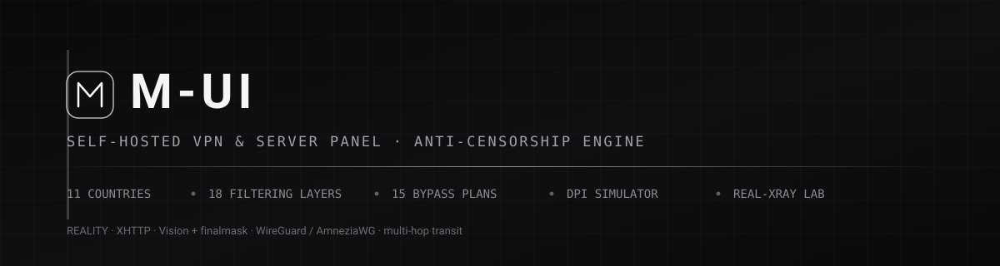

<div align="center">
  
  <br><br>

  [English](README.md) · [فارسی](README.fa.md) · [Русский](README.ru.md) · [العربية](README.ar.md) · **中文**

  [](https://nextjs.org)
  [](tsconfig.json)
  [](tests)
  [](docs/i18n.md)
  [](docker-compose.yml)
  [](LICENSE)

  *自托管的代理服务器控制面板 —— 附带一套像代码一样被测量、被版本化、被测试的
  审查模型。*
</div>

---

## 概览

**M-UI** 是用于管理服务器、代理配置与隧道的自托管面板。它通过 SSH 在真实机器
上创建真实访问、让分享链接保持稳定，并且——大多数面板省略的部分——**对客户端
与服务器之间的审查系统建模**，使一份配置在交付给用户之前就能被评估。

| | 内容 | 位置 |
|---|---|---|
| **面板** | 服务器、监控、配置、隧道、用户与角色、SOCKS5 部署、WireGuard、五语言界面 | `src/pages`、`src/lib` |
| **审查引擎** | 11 个国家 × 18 个过滤层 × 15 种绕行方案，评分模型与按国家生成配置 | `src/lib/censorship` |
| **实验室** | Python DPI 模拟器与真实 Xray 端到端测试台 —— 模型必须对其负责 | `testenv/censor`、`testenv/world-matrix.py` |

引擎与实验室不是装饰：只要模型与模拟器出现偏差、某个层被标为「已模拟」却没有
测量支撑、或生成的过境配置不被 Xray 本身接受，`npm test` 就会失败。

---

## 功能

| 领域 | 说明 |
|---|---|
| **服务器** | 支持密码或 SSH 密钥；保存前先做真实验证。密钥加密存储，任何接口都不会回显。 |
| **监控** | 直接读取服务器 `/proc` 的 CPU、内存、load、uptime 与流量，定时采样并绘制七天曲线。失联服务器标记为过期，而不是显示编造的数字。 |
| **配置** | VMess、VLESS、Trojan、Shadowsocks 分享链接，支持 TLS、WebSocket、gRPC、HTTP、KCP、QUIC 与 CDN；REALITY（`pbk`/`fp`/`sid`）；XHTTP 的 `stream-up` 模式。 |
| **稳定身份** | UUID 与密码只生成一次并持久化，链接不会在用户手中改变。 |
| **SOCKS5 部署** | 在目标服务器上安装并运行 microsocks，每个配置独立凭据，覆盖 `apt`、`dnf`、`yum`、`apk`。 |
| **WireGuard** | 生成 X25519 密钥对与可直接导入的客户端 `.conf`。 |
| **隧道** | SSH 反向隧道通过 OpenSSH 真实启停。Direct、FRP 与 WireGuard 目前仅登记。 |
| **连接顾问** | 按目标网络的真实画像评估配置：被封禁的 SNI、不可用端口、危险的 uTLS 指纹、UDP 处理方式、协议白名单。 |
| **审查地图** | 每个国家独立页面：过滤层及其严重度与可信度、带理由的方案排名、获胜方案的生成配置、过境链路，以及每条结论的来源。 |
| **多跳过境** | 入口 → 中继 → 出口链路，逐跳生成真实 Xray 配置，并在测试中用 `xray run -test` 验证。 |
| **访问控制** | JWT 会话、bcrypt、登录限流（未知用户响应时间一致）、所有写接口强制角色校验。 |
| **部署** | 源码 `docker compose` 或 `npm ci && npm run build`。生产模式缺少 `JWT_SECRET` 时拒绝启动。 |

---

## 审查模型如何工作

对每一对（国家，方案），引擎回答：*如果客户端从该网络以这种方式连接，哪些层
会拦截它，又有什么能补偿？*

**层**共 18 种机制：DNS 污染、SNI 重置、ECH 丢弃、TCP 重组、QUIC v1 指纹、完全
加密流量启发式、JA4 白名单、协议白名单、IP/ASN 封锁、主动探测、流分类、
TLS-in-TLS 启发式。

**方案**共 15 种协议、传输、安全与混淆组合：从
`VLESS + REALITY + Vision + finalmask` 到裸 `WireGuard`。

**国家**共 11 个画像，含严重度与可信度标签：`measured`、`reported`、`heuristic`。

```text
score = 100 − Σ penalty
penalty = 5 × severity   未覆盖层        (severity 1–5)
        + 3 × severity   部分覆盖层
        + 40             该方案端口在国家内被封锁时

85+ 抗封锁      65–84 可用      45–64 脆弱      低于此值：避免
```

### 覆盖矩阵

完整表格为 15 个方案 × 11 个国家。

| 方案 | 🇮🇷 ir | 🇷🇺 ru | 🇨🇳 cn | 🇹🇲 tm | 🇧🇾 by | 🇦🇪 ae | 🇰🇿 kz | 🇹🇷 tr | 🇵🇰 pk | 🇸🇦 sa |
|---|:--:|:--:|:--:|:--:|:--:|:--:|:--:|:--:|:--:|:--:|
| **reality-vision-frag** | 91 ✅ | **67** 🟢 | 76 🟢 | 76 🟢 | 91 ✅ | 94 ✅ | 91 ✅ | 100 ✅ | 91 ✅ | 100 ✅ |
| reality-vision | 91 ✅ | 32 🔴 | 76 🟢 | 76 🟢 | 91 ✅ | 94 ✅ | 76 🟢 | 100 ✅ | 91 ✅ | 100 ✅ |
| reality-xhttp | 91 ✅ | 41 🔴 | **88 ✅** | 76 🟢 | 91 ✅ | 94 ✅ | 76 🟢 | 100 ✅ | 91 ✅ | 100 ✅ |
| ws-tls-cdn | 80 🟢 | 11 🔴 | 51 🟠 | **80** 🟢 | 80 🟢 | 80 🟢 | 85 ✅ | 85 ✅ | 75 🟢 | 85 ✅ |
| ss2022-tls-plugin | 79 🟢 | 9 🔴 | 49 🟠 | 68 🟢 | 79 🟢 | 85 ✅ | 64 🟠 | 91 ✅ | 79 🟢 | 91 ✅ |
| trojan-tls | 64 🟠 | 9 🔴 | 24 🔴 | 48 🟠 | 79 🟢 | 85 ✅ | 64 🟠 | 91 ✅ | 79 🟢 | 91 ✅ |
| hy2-obfs-unknownver | 33 🔴 | 0 🔴 | 17 🔴 | 31 🔴 | 73 🟢 | 64 🟠 | 58 🟠 | 85 ✅ | 70 🟢 | 82 🟢 |
| amneziawg | 25 🔴 | 0 🔴 | 0 🔴 | 31 🔴 | 65 🟢 | 58 🟠 | 50 🟠 | 79 🟢 | 62 🟠 | 76 🟢 |
| vmess-ws-tls | 45 🟠 | 0 🔴 | 1 🔴 | 60 🟠 | 60 🟠 | 65 🟢 | 65 🟢 | 70 🟢 | 55 🟠 | 70 🟢 |
| wireguard（裸） | 0 🔴 | 0 🔴 | 0 🔴 | 0 🔴 | 35 🔴 | 28 🔴 | 40 🔴 | 60 🟠 | 25 🔴 | 55 🟠 |
| openvpn-tcp | 11 🔴 | 0 🔴 | 0 🔴 | 0 🔴 | 51 🟠 | 47 🟠 | 56 🟠 | 70 🟢 | 46 🟠 | 70 🟢 |
| ssh-tunnel | 11 🔴 | 0 🔴 | 0 🔴 | 23 🔴 | 51 🟠 | 47 🟠 | 56 🟠 | 70 🟢 | 46 🟠 | 70 🟢 |
| hy2-obfs (quic v1) | 25 🔴 | 0 🔴 | 0 🔴 | 31 🔴 | 69 🟢 | 58 🟠 | 54 🟠 | 81 🟢 | 64 🟠 | 76 🟢 |
| ss2022-plain | 5 🔴 | 0 🔴 | 0 🔴 | 0 🔴 | 45 🟠 | 43 🔴 | 50 🟠 | 70 🟢 | 40 🔴 | 70 🟢 |
| vmess-tcp-plain | 5 🔴 | 0 🔴 | 0 🔴 | 0 🔴 | 45 🟠 | 43 🔴 | 50 🟠 | 70 🟢 | 40 🔴 | 70 🟢 |

这是 2026 年的世界地图，而非排行榜：有些国家由全面规则决定（土库曼斯坦、
伊朗、俄罗斯），有些由流量分类决定（中国、阿联酋），有些只是部分域名被封
（土耳其、沙特、巴基斯坦、白俄罗斯）。REALITY + Vision 是地板而不是天花板：
加上分片后，它是唯一能在四个困难国家都过关的设计，但在俄罗斯也只有 67 分。

---

## 各国工程实践

### 🇷🇺 俄罗斯 —— TSPU / RKN

模型中难度最高的画像。TSPU 位于链路中且是有状态的：同时重组 **TCP 流与**
TLS 记录；对超过约 1000 字节的 QUIC v1 Initial 直接丢弃整条流；丢弃携带 ECH
的握手；在 SYN 层封锁境外云 ASN；并且据 2025 年年中以来的报告，部分地区运行
**SNI 白名单**。

| 层 | 严重度 | 可信度 | 检查内容 |
|---|:--:|:--:|---|
| `sni_block` | 5 | measured | SNI 黑名单，并对其余流量按 SNI 限速 |
| `proto_fingerprint` | 5 | measured | 固定握手：WireGuard 的 148 字节 initiation、OpenVPN opcode |
| `reassembly` | 4 | measured | 同时重组 TCP 段 **与** TLS 记录 |
| `quic_v1_fingerprint` | 4 | measured | 载荷超过约 1000 字节的 QUIC v1 Initial |
| `ip_block` | 4 | measured | 境外云 ASN（Hetzner、OVH、DigitalOcean）在 SYN 层封锁 |
| `sni_whitelist` | 4 | reported | SNI 白名单模式（分地区） |
| `ech_drop` | 3 | measured | 携带 ECH 的 ClientHello —— 自 2024 年 11 月起 |
| `udp_filter` | 3 | measured | DNS 之外的 UDP |
| `ml_flow` | 3 | reported | 统计式流分类 |

**有效做法**

1. **切两次。** 这是模型里最有价值的结论：仅切分 TCP 段不够，仅切分 TLS 记录
   也不够；两者结合才能击穿重组，因为任何一侧都无法独立还原。`reality-vision-frag`
   比同协议不做分片多拿 **35 分**（67 对 32）。
2. **用 `finalmask`，而不是 `streamSettings.fragment`。** 在 Xray 26.3.27 上
   实测：旧键只产生一条 1818 字节记录；`finalmask` 稳定产生 **5 条记录**
   `[118, 155, 192, 183, 1106]`。
3. **把 QUIC v1 当作被封。** 按画像规则丢弃的是整条流而不是单个包。Hysteria2
   只有「未知版本 Initial」变体能存活，而且只是部分覆盖。
4. **不要开启 ECH。** 发往 Cloudflare SNI 的 ECH 握手会被丢弃 —— 为了「隐私」
   开启 ECH 等于切断连接。
5. **不要选已被封的云 ASN。** 入口 IP 落在黑名单 ASN 里时，上面所有条都不再
   重要。

**结论：**`reality-vision-frag` **67/100**，唯一进入高位区间的方案。

---

### 🇨🇳 中国 —— GFW

它是分类器而非清单。可靠部分是 DNS 污染与 SNI 封锁；有意思的部分是**完全加密
流量识别**（五条豁免启发式、按概率执行）以及大规模 QUIC Initial 解密。

**有效做法**

1. **通过豁免清单，而不是「击败」它。** 启发式是结构性的：可打印字符占比、
   最长可打印串、开头可打印字节、popcount 熵带，以及可识别的协议指纹。裸
   Shadowsocks-2022 从第 0 字节起全是随机数据，天然五条全不通过；把它包进
   TLS + WebSocket 后分数从 0 提升到 49–88。
2. **封锁是概率性的，实验室已经证实。** 在真实运行中，SS-2022 在 **8 次连接
   中 4–5 次**被重置，VMess-over-TCP 为 **3–5 次**，取决于首包的随机盐。因此
   该用例断言为 `mixed` 而非 `block`。
3. **把流向拆开。** 这正是 XHTTP 存在的理由：`mode: stream-up` 让上行与下行
   位于两条不同流，需要同一连接双向的启发式因此失去依据。`reality-xhttp` 是
   该国最佳方案：**88/100**。
4. **QUIC 只有无版本号时才安全。** 可解密的 Initial 会被解密并过滤；未知版本
   的 Initial 根本无法解密。

**结论：**`reality-xhttp` **88/100**；`reality-vision-frag` 与
`reality-vision` 为 76。

---

### 🇮🇷 伊朗 —— NGFW 体系与国家级过滤

DNS 污染、SNI 重置，以及决定性的**协议白名单**：只有 DNS 与 HTTP(S) 能出境，
不具备 TLS 外形（且在允许端口上）的隧道无论用哪个端口都会被丢弃。

**有效做法**

1. **在 443 上变成 TLS。** REALITY 是最短路径：握手是与真实站点的真实 TLS
   握手，证书借自未被封锁的目标。
2. **不要携带嵌套长度特征。** `flow: xtls-rprx-vision` 消除内部 TLS 记录尺寸
   特征 —— 这正是裸 Trojan 与 VMess-over-TLS 在此退化的原因。
3. **在记录层与段层同时切分。** `finalmask` 把 ClientHello 切成多条带延时的
   TLS 记录，使 SNI 永不完整出现在同一段中。注意旧键
   `streamSettings.fragment` 在 Xray 25+ 会被静默忽略。
4. **不要依赖 UDP。** 任何 QUIC 或 WireGuard 方案在这里都 ≤ 33 分。

**结论：**REALITY 系列 **91/100**；一切没有 TLS 外形的方案落在 0–45。

---

### 🇹🇲 土库曼斯坦 —— 完整白名单

不是过滤器而是准入清单：只有少量本国域名与获批服务可以通行，默认答案是
「不行」。**有效做法：**用 CDN 掩护（`ws-tls-cdn` → **80/100**，该国最佳）、SNI
必须取自允许集合、入口选 CDN 的 ASN 而非 VPS 的 ASN、完全放弃 UDP 方案。

### 🇦🇪 阿联酋 —— JA4 指纹白名单

唯一由 **TLS 指纹白名单**决定的国家：DPI 期望看到真实浏览器的 ClientHello。
**有效做法：**逐字节发送浏览器指纹；并且**用 JA4 而不是 JA3** —— 我们的实测
显示，使用 `chrome` 画像连续 15 次连接得到 **15 个不同 JA3**（Chrome 会打乱
扩展顺序），而 JA4 只有一个稳定值
`t13d1516h2_8daaf6152771_8ee26baaef31`；绝不要用随机指纹，它每次都变化、永远
进不了白名单（实验室正是断言这一点：`ae-tls-randomized` → 因
`ja4_fingerprint` 被封）。**结论：**REALITY 系列与浏览器指纹方案
**94/100**。

### 🇧🇾 白俄罗斯 · 🇰🇿 哈萨克斯坦 · 🇹🇷 土耳其 · 🇵🇰 巴基斯坦 · 🇸🇦 沙特

| 国家 | 系统 | 关键层 | 结论 |
|---|---|---|---|
| 🇧🇾 白俄罗斯 | Belpak，俄式模型但无重组 | `sni_block` 4、`proto_fingerprint` 4 | REALITY — **91**；只有这里混淆 UDP 能存活（AmneziaWG 65、Hysteria2 69/73） |
| 🇰🇿 哈萨克斯坦 | 出口版 GFW/TSPU 技术栈 | `sni_block` 4、`ech_drop` 3 | REALITY — **91**，CDN — 85；保持 ECH 关闭 |
| 🇹🇷 土耳其 | BTK，事件式封锁 | `sni_block` 3、`proto_fingerprint` 3 | REALITY 与 CDN **100**；15 个方案中 14 个 > 65 |
| 🇵🇰 巴基斯坦 | PTA，出口技术栈 | `proto_fingerprint` 5 | REALITY — **91**，WS+TLS 下的 SS-2022 — 79 |
| 🇸🇦 沙特 | CITC | `proto_fingerprint` 3、`sni_block` 3 | REALITY 与 CDN **100** |
| 🌐 开放网络 | 无过滤 | — | 参照画像：所有方案均为 100 |

---

## 我们自己做的测量

| # | 测量 | 结果 | 复现方式 |
|:--:|---|---|---|
| 1 | **JA3 与 JA4 的稳定性**（uTLS Chrome，Xray 26.3.27） | 15 次连接 → **15 个不同 JA3**、**1 个 JA4**。判定必须用 JA4。 | `testenv/censor/fpmeasure.py --cert <cert> --write-ts` |
| 2 | **旧 `fragment` 与 `finalmask`** | 旧键无效：单条 1818 字节记录。`finalmask` → **5 条记录** `[118, 155, 192, 183, 1106]`。 | `testenv/frag-probe.py` |
| 3 | **段切分与记录切分** | 记录切分是确定且可断言的；TCP 段切分不是，因为内核会合并连续写入。测试断言 `record_split`，仅报告 `tcp_split`。 | `testenv/frag-probe.py`、`testenv/world-matrix.py` |
| 4 | **每跳开销** | 1 跳 91.463 ms，3 跳 91.906 ms → 每跳 **0.222 ms**。 | `testenv/transit-lab.py` |
| 5 | **占位 REALITY 私钥会被拒绝** | Xray 以 **rc=23** 退出，因此未配置完整的生成配置不可能被误启动。 | `tests/transit.test.ts` |
| 6 | **完全加密流量识别是概率性的** | 测试台中 SS-2022 在 **8 次中 4–5 次**、VMess-over-TCP 在 **3–5 次**被重置。 | `testenv/world-matrix.py --only cn` |

模型是唯一事实来源：`rules.json` 由 `countries.ts` 生成并逐字节比对，Python
模拟器因此无法与 TypeScript 模型脱节。

---

## DPI 实验室

```text
  xray 客户端 ──► 审查代理 ──► xray 服务端 ──► 测试靶机 ──► 目标站点
  (真实配置)      (国家规则)   (reality/tls/     dest:9447    http/https
                                ss/vmess)
                     │
                     └──► 每条流的判定 + 证据
```

15 个用例，运行 `python3 testenv/world-matrix.py`：`ru-reality-frag`（allow，
`record_split`）、`ru-reality-plain`（对照组）、`ru-reality-blocked-sni`
（`sni_block`）、`tm-whitelisted-sni` / `tm-other-sni`（`sni_whitelist`）、
`ir-reality` / `ir-ss2022`（`proto_whitelist`）、`ae-tls-chrome` /
`ae-tls-randomized`（`ja4_fingerprint`）、`cn-tls-not-simulated`、
`cn-reality-vision`、`cn-reality-frag`、`cn-ss2022` 与 `cn-vmess-tcp`
（`fep_detect`，`mixed`，4–5 与 3–5 / 8）、`open-ss2022-control`。

同一套测试台与规则：`python3 testenv/censor/selftest.py` 执行 **66** 项模拟器
级检查。

---

## 多跳过境

| 跳 | 角色 | 方案 | 原因 |
|---|---|---|---|
| `tr:443` | 入口 | REALITY + Vision + finalmask，Chrome 指纹 | 唯一被目标国审查系统观察的一跳；所有高严重度层在此被吸收 |
| `de:8443` | 中继 | REALITY + Vision | 入口地址可弃：失效时用户只需更换 IP，而不必换配置 |
| `nl:2053` | 出口 | REALITY + Vision | 靠近目标服务；这才是世界看到的 IP |

`hopConfigs()` 为每一跳生成完整配置以及客户端配置，`tests/transit.test.ts`
用新生成的 X25519 密钥把每份配置送进 `xray run -test` 验证。实测开销：
**每跳 +0.222 ms**（loopback；地理延迟未建模）。

---

## 验证

| 套件 | 结果 | 命令 |
|---|:--:|---|
| 单元测试（vitest，10 个文件） | **114 / 114** | `npm test` |
| 审查模拟器 | **66 / 66** | `python3 testenv/censor/selftest.py` |
| 端到端实验室（真实 Xray） | **15 / 15** | `python3 testenv/world-matrix.py` |
| 分片测量 | **PASS**（1 → 5 条记录） | `python3 testenv/frag-probe.py` |
| 过境测量 | **PASS**（1 与 3 跳） | `python3 testenv/transit-lab.py` |
| 类型检查 · 生产构建 | 干净 · `/atlas` 12.6 kB | `npx tsc --noEmit`、`npm run build` |

---

## 快速开始

```bash
git clone https://github.com/mmdverse/m-ui
cd m-ui
cp .env.example .env        # 填写 JWT_SECRET 与 ADMIN_PASSWORD
npm ci
npm run build && npm start
```

面板运行在 `http://localhost:3000`，首个管理员在首次启动时由环境变量创建。

```bash
JWT_SECRET=$(openssl rand -hex 32) \
ADMIN_PASSWORD='强密码' \
MONGO_PASS='数据库密码' \
  docker compose up -d
```

<details>
<summary><b>环境变量</b></summary>

| 变量 | 必需 | 用途 |
|---|:--:|---|
| `JWT_SECRET` | ✔（生产） | 会话签名；生产模式下缺少则拒绝启动 |
| `MONGODB_URI` | ✔ | MongoDB 连接串 |
| `M_UI_ENCRYPTION_KEY` | 建议 | 加密存储的密钥，与 `JWT_SECRET` 分离以便独立轮换 |
| `ADMIN_USERNAME` / `ADMIN_PASSWORD` | 首次启动 | 创建首个管理员（至少 8 字符） |
| `PORT` | — | 面板端口，默认 3000 |

</details>

面板页面：`/` 登录 · `/dashboard` · `/servers` · `/configs` · `/advisor` ·
`/atlas` · `/tunnels` · `/users` · `/logs` · `/settings`。

---

## 支持项目

项目由一个人维护。捐助用于最枯燥却最关键的部分：测量观测点，让审查地图能从
它所描述的国家内部被验证，而不是只依赖一台机器；也用于扩大 FEP 样本量与保持
实验室与 CI 全绿。

<table>
<tr><th align="left">网络</th><th align="left">地址</th></tr>
<tr><td><b>Bitcoin</b> <code>BTC</code></td><td><code>bc1q36uzqlkaav3lkscknhemcem0lcjtkhepdqckul</code></td></tr>
<tr><td><b>BNB Smart Chain</b> <code>BEP-20</code></td><td><code>0x57902d3955D5F1C0fbCaEA0a12A7D691c792487E</code></td></tr>
<tr><td><b>Solana</b> <code>SOL</code></td><td><code>4hCYetZjvK8mkuobRvPYXyRnM84aTj3q8LZ1GpiTK8HR</code></td></tr>
<tr><td><b>Tron</b> <code>TRC-20</code></td><td><code>TVFZKSwMYNw1jiCyKKtKoVG3HbpB4DhsA5</code></td></tr>
</table>

```text
Bitcoin (BTC)         bc1q36uzqlkaav3lkscknhemcem0lcjtkhepdqckul
BNB Smart Chain      0x57902d3955D5F1C0fbCaEA0a12A7D691c792487E
Solana (SOL)         4hCYetZjvK8mkuobRvPYXyRnM84aTj3q8LZ1GpiTK8HR
Tron (TRC-20)        TVFZKSwMYNw1jiCyKKtKoVG3HbpB4DhsA5
```

转账前请在自己的钱包中核对地址。把带有可复现结果的用例加进
`world-matrix.py`，其价值超过大多数 pull request。

---

## 许可

MIT —— 见 [LICENSE](LICENSE)。本项目面向合法用途：运行你自己的基础设施、在
你有权使用的网络上保护隐私，以及审查研究。模型依据已发表研究与公开测量描述
过滤系统；其中不含任何凭据、可用的绕过基础设施或用户数据。

<div align="center">
<br>
<b>由 ❤️ 制作 <a href="https://t.me/llllxyz">Mohammad</a></b><br>
<sub><code>@llllxyz</code> · M-UI · MIT</sub>
</div>
